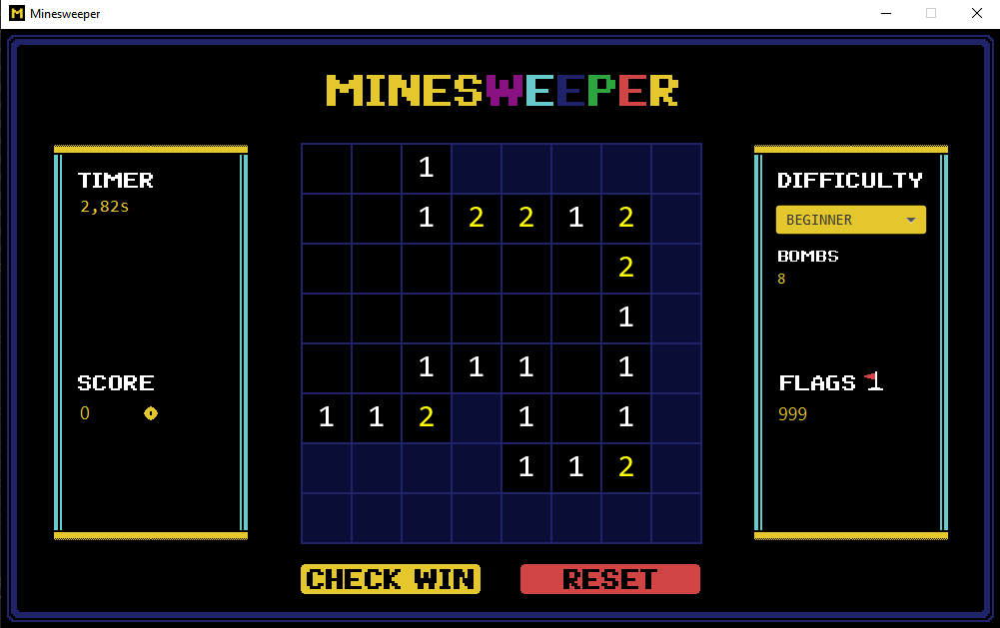
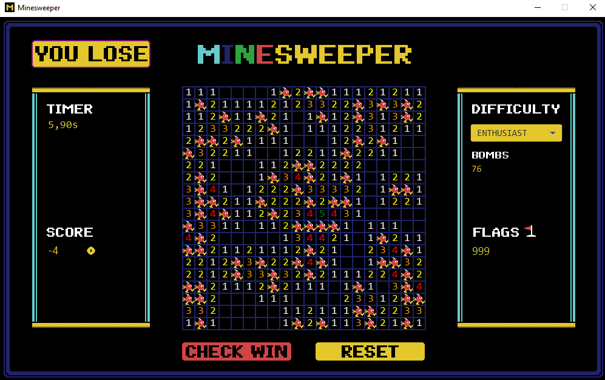

# Minesweeper JavaFX

### Made by Dino Kupinic

---

### Features:
- 3 Difficulties
- 8-bit pixel art
- Highscore
- Flags

How to run:
---
Navigate to \out\artifacts\Minesweeper_jar and double-click Minesweeper.jar.
You can also open it in an IDE.

### Class Diagram

---

### Preview images

